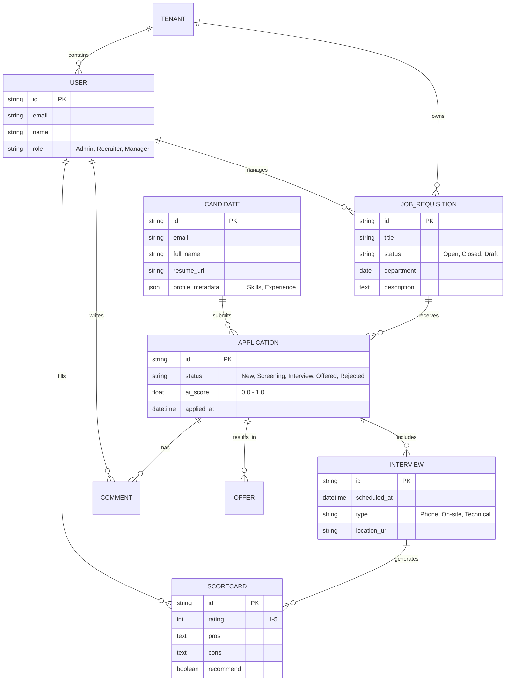
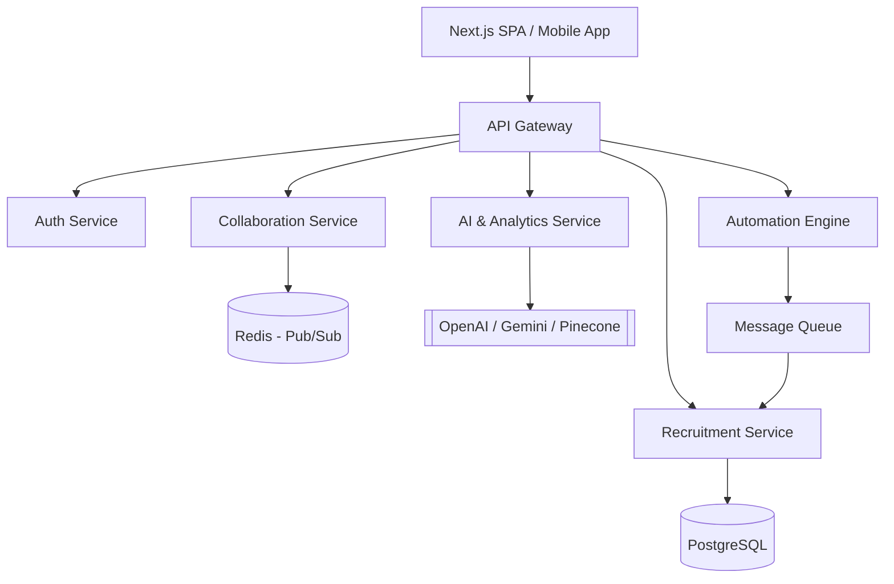
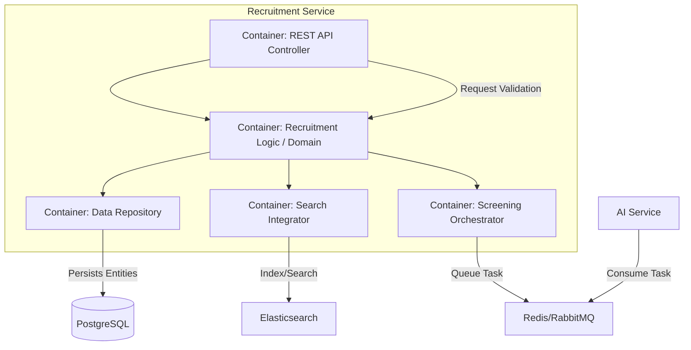

# LTI - Next-Gen Applicant Tracking System (ATS)

## 1. Executive Summary: The LTI Vision

LTI is not just another recruitment tool; it is the **ATS of the future**. In an era where talent is the ultimate competitive advantage, LTI empowers HR departments to move faster, collaborate better, and make data-driven hiring decisions using state-of-the-art AI.

### Added Value
- **AI-First Workflow**: Moves beyond simple keyword matching to semantic understanding of candidate potential.
- **Hyper-Collaboration**: Eliminates "email silos" by centralizing all feedback and communication in real-time.
- **Process Speed**: Reduces manual overhead by up to 70% through intelligent automation.

### Competitive Advantages
- **Native Generative AI**: Integrated assistance for job description drafting, outreach, and bias detection.
- **Frictionless Candidate Experience**: Self-service portals and 24/7 AI-driven support.
- **Predictive Intelligence**: Foresees hiring bottlenecks before they happen using historical trend analysis.

---

## 2. Main Functions

1.  **AI SmartScreener**: Automatically ranks and summarizes resumes based on job requirements and company culture fit.
2.  **CollabHub**: A real-time workspace for recruiters and hiring managers with @mentions, shared feedback threads, and collaborative decision tools.
3.  **AutoFlow Automations**: Custom triggers that handle interview scheduling, status updates, and document collection (e-signatures) without human intervention.
4.  **Shared Scorecards**: Structured evaluation templates that ensure objective, consistent interviewing across the entire organization.
5.  **Predictive Talent Analytics**: Dashboards that track real-time KPIs (Time to Hire, Source Quality, Pipeline Velocity) and forecast future needs.
6.  **Omnichannel Outreach**: Integrated communication via Email, Slack, LinkedIn, and SMS to keep candidate engagement high.

---

## 3. Lean Canvas Diagram

```mermaid
canvas
  title LTI - Lean Canvas
  
  %% Left side
  section Problem
    - High Time-to-Hire
    - Manual screening overhead
    - Siloed communication between HR and Managers
    - Fragmented candidate data
  
  section Solution
    - AI-driven ranking/screening
    - Real-time collaboration hub
    - End-to-end automation triggers
    - Centralized data "source of truth"
  
  section Key Metrics
    - Time-to-Hire
    - Source Quality
    - Candidate NPS (Net Promoter Score)
    - Offer Acceptance Rate (%)
  
  %% Middle
  section Unique Value Proposition
    - "The ATS that thinks like a recruiter."
    - AI-native intelligence to find the right fit 10x faster.
    - Zero-friction collaboration.
  
  section High-Level Concept
    - "Slack + ChatGPT for Recruitment"
  
  %% Right side
  section Unfair Advantage
    - Proprietary bias-detection algorithms
    - Deep integration with Slack/Teams for flow-of-work hiring
    - Predictive analytics engine
  
  section Channels
    - Direct Sales to mid-market/enterprise
    - Content Marketing (HR Tech blogs)
    - Partnerships with HR Consulting firms
    - Product-Led Growth (Free tier)
  
  section Customer Segments
    - Fast-growing Tech Startups
    - Mid-market HR departments
    - Specialized Recruitment Agencies
  
  %% Bottom
  section Cost Structure
    - Cloud Infrastructure (AWS/Azure)
    - AI Model API costs (OpenAI/Anthropic)
    - Sales & Marketing
    - Product Development
  
  section Revenue Streams
    - Tiered Subscription (SaaS)
    - Per active recruiter seat
    - Enterprise custom integrations
    - AI-credits for high-volume screening
```

---

## 4. Main Use Cases

### UC1: AI-Driven Candidate Screening & Ranking
**Description**: When a high volume of applications is received, the AI analyzes resumes, ranks them by relevance, and highlights top candidates, saving recruiters hours of manual review.

```mermaid
useCaseDiagram
    actor "Recruiter" as R
    actor "System" as S
    package "Screening Module" {
        usecase "Upload/Receive Resumes" as UC1
        usecase "AI Semantic Analysis" as UC2
        usecase "Rank Candidates" as UC3
        usecase "Highlight Top Talent" as UC4
    }
    R --> UC1
    UC1 --> S
    S --> UC2
    UC2 --> UC3
    UC3 --> UC4
    UC4 --> R
```

### UC2: Real-Time Collaborative Evaluation
**Description**: Recruiters and Hiring Managers interact on a candidate's profile in real-time, sharing feedback through @mentions and completing scorecards immediately after interviews.

```mermaid
useCaseDiagram
    actor "Recruiter" as R
    actor "Hiring Manager" as HM
    actor "Interviewer" as I
    package "Collaboration Module" {
        usecase "Complete Shared Scorecard" as UC5
        usecase "Post Internal @Comment" as UC6
        usecase "View Aggregated Feedback" as UC7
        usecase "consensus build" as UC8
    }
    I --> UC5
    R --> UC6
    HM --> UC6
    R --> UC7
    HM --> UC7
    UC7 --> UC8
```

### UC3: Automated Offer Management
**Description**: Once a candidate is selected, the system generates an offer letter, sends it for e-signature with automated follow-ups, and triggers the onboarding workflow upon acceptance.

```mermaid
useCaseDiagram
    actor "Recruiter" as R
    actor "Candidate" as C
    actor "System" as S
    package "Offer Module" {
        usecase "Generate Offer from Template" as UC9
        usecase "Send for E-Signature" as UC10
        usecase "Monitor/Follow-up" as UC11
        usecase "Trigger Onboarding" as UC12
    }
    R --> UC9
    UC9 --> UC10
    UC10 --> C
    S --> UC11
    C --> UC10
    UC10 --> UC12
```

---

## 5. Data Model

The LTI data model is designed for scalability and high-density interaction.



---

## 6. High-Level System Design

LTI follows a **Cloud-Native Microservices Architecture** to ensure high availability, scalability, and seamless integration with third-party AI models and communication platforms.

### Architecture Overview
1.  **Frontend**: Single Page Application (SPA) built with React/Next.js for a premium, responsive UX.
2.  **API Gateway**: Handles authentication, logging, and routing to various microservices.
3.  **Core Services**:
    *   **Recruitment Service**: Manages jobs, applications, and workflows.
    *   **Collaboration Service**: Handles real-time messaging, @mentions (WebSockets), and feedback.
    *   **AI Engine**: Integrates with LLMs (Gemini/OpenAI) via asynchronous message queues for heavy processing (resume screening, content generation).
    *   **Automation Service**: Event-driven engine (EventBridge/Kafka) that triggers actions based on state changes.
4.  **Storage**: 
    *   **PostgreSQL**: For relational, transactional data.
    *   **Elasticsearch/Pinecone**: For vector-based candidate searching and semantic match.
    *   **AWS S3**: For resume and document storage.



---

## 7. C4 Diagram: Recruitment Service (Container/Component Level)

We go in depth into the **Recruitment Service**, the core orchestrator of the system.



This service ensures that job lifecycles and application flows are managed consistently while decoupling heavy AI screening tasks via a message queue to maintain responsiveness.
